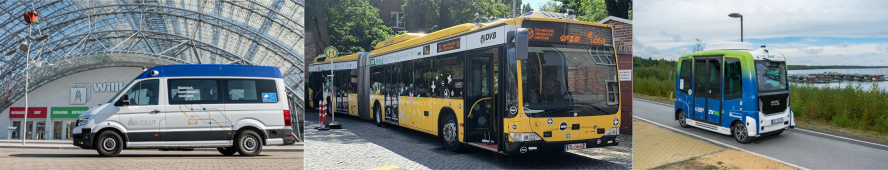

## TU Dresden - Automotive Mechatronics

*Author:* [Georg Beierlein](https://github.com/GeorgBe)  
*Updated:* 2026/06/16

This is the official organization for open-source software components by the Chair for Automotive Mechatronics.

Our research covers the following areas:

- Automated driving systems and their architecture especially for automated public transport
- Energy and Information Management in Motor Vehicles
- Electrical/Electronic Architectures with Regard to Functional Orientation
- Diagnostics, Extended System Trial and Scrutiny of E/E Systems

The repositories provided here mainly relate to the first area, our research on automated public transport.

Refer to the following links for more information:

---

[Homepage](https://tu-dresden.de/bu/verkehr/fm) | [LinkedIn](https://www.linkedin.com/company/fzmtudresden/)
